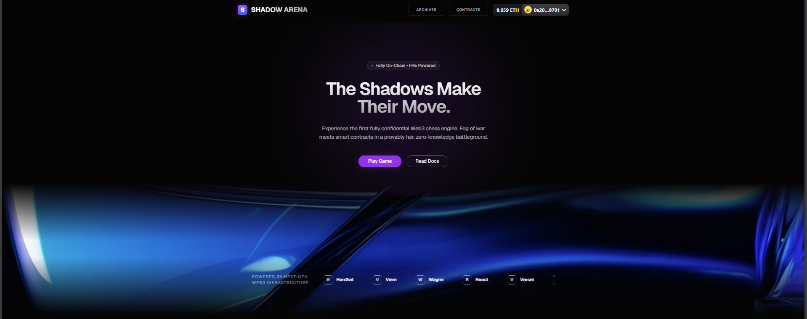

# ♟️ Shadow Arena

> **The first fully confidential Web3 chess engine. Fog of war meets smart contracts in a provably fair, zero-knowledge battleground.**




## 🌐 Overview
Traditional on-chain games suffer from the "dark forest" problem—all state is public. If you play chess on a standard blockchain, your opponent can read the smart contract to see your moves before they resolve. 

**Shadow Arena** solves this by utilizing **Fully Homomorphic Encryption (FHE)**. By keeping the game state encrypted on-chain, we introduce true **Fog of War** mechanics. You only see what your pieces can see, and the blockchain validates the rules without ever exposing the hidden board state.

## ⚙️ Tech Stack
This project leverages next-gen Web3 infrastructure:
* **Frontend:** React, TypeScript, Tailwind CSS, Vite
* **Web3 Integration:** Viem, Wagmi
* **Smart Contracts:** Solidity, Hardhat
* **Confidentiality:** Zama FHE (Fully Homomorphic Encryption)
* **Deployment:** Vercel

## 🧠 How the FHE Works
In standard chess, there is perfect information. In Shadow Arena:
1. **Encrypted Moves:** Players submit their moves as encrypted ciphertexts.
2. **On-Chain Computation:** The FHE smart contract computes the validity of the move *while it remains encrypted*.
3. **Selective Decryption:** The contract only decrypts and reveals the information your specific pieces have the "line of sight" to see.

## 🚀 Local Setup & Installation

**1. Clone the repository**
```bash
git clone [https://github.com/Jhaycrypt001/shadow-arena.git](https://github.com/Jhaycrypt001/shadow-arena.git)
cd shadow-arena